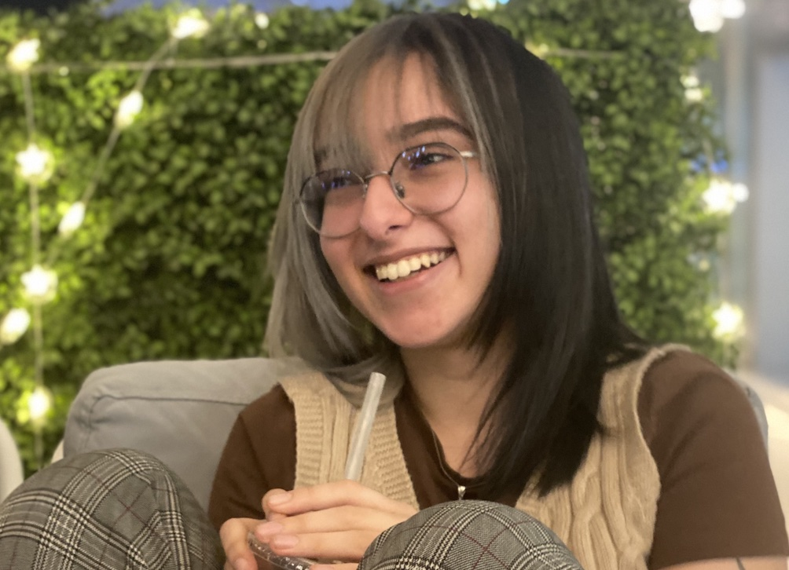

About me
============
Samar Rahmouni
----

>  Formal Verification & Reinforcement Learning \
>  The future is neurosymbolic
----

Education
---------

2023 - ??
:   **Master en Rercherche Informatique**; Ecole Polytechnique, Paris
* Projet M1 on Graphical Algebra and its applications to Category Theory, implementation in Agda
  *  Advised by Samuel Mimram 
* Stage M1 with Partout on an implementation of proof search for Pomset and BV logic 
  * Advised by Lutz Straßburger

2018-2022
:   **B.S., Computer Science**; Carnegie Mellon University
* Honors Thesis: Domain Informed Oracle for Reinforcement Learning
  * Advised by Giselle Reis, Gianni Di Caro and Eduardo Feo Flushing 
* Concentration in Programming Languages

Experience
----------

* **Stagiaire M1** 
  * **@ Partout - INRIA Saclay** 
  
Implemented proof search for Pomset and BV logic, as part of the effort to have a useful tool for researchers. In the process of both verifying the correctness of the prover and choosing heuristics to optimize the search. 

* **Course Assistant for Constructive Logic (15-317) and Artificial Inteligence (15-281)**
  * **@ CMU Qatar**

Provided 1-1 tutoring to provide students with weekly helped, made autograders for the programming sections of the homeworks, wrote guidelines and reviewed midterms and assignments. 

* **Teaching Assistant for Software Foundations of Security and Privacy (15-316)**
  * **@ CMU Pittsburgh and Qatar**

Proctored examinations, met weekly with the teaching staff to better adapt grading and wordings. In Qatar, I wrote the homework solutions for future iterations of the course.

* **Undergraduate Research Assistant**
  * **@ CMU Qatar**
Funded by Giselle Reis. 

Implemented a theorem prover for classical and constructive logic where the underlying types are objects. The prover was later automated for classical by making use of G3CP invertible rules. The project has an easy-to-use graphical interface to be used by students learning about logic. 

* **Java Instructor** 
  * **@ CMU Africa**

Taugh Computer Science teachers basics of Java, by designing 2-week curriculum. Met with President Paul Kagame to discuss the future of education in Rwanda. The project was done by closely working with CMU Pittsburgh and CMU Africa. 

Research Experience
--------------------

**Proof Search in Pomset and BV logic (in progress)** 
Advised by Lutz Straßburger 
* Implementation was done in Ocaml while making use of the 'Logical' tool for the proof search of BV, specifically. 
* Proof search in Pomset was implemented as the search of cycles on graphs: restricted to balanced formulas 
* The implementation in Pomset was used as a benchmark for testing the proof search on BV 
* [(www.)](prospectus.pdf)

**Proof Assistant for Categories encoded in an Equational Graphical Language** Advised by Samuel Mimram
* Link between equational and graphical structures. 
* Transforming the categorical definition of a terminal object to an equational definition using the work done by Albert Burroni.  
* Defined the relevant type system and its rules for terms, contexts and equalities 

**Domain Informed Oracle for Reinforcement Learning (dio):** Advised by Giselle Reis, Gianni Di Caro and Eduardo Feo Flushing
* Implemented a domain-informed module in ProgLog to guide the reward shaping of a Reinforcement Learning (RL) module 
* Independently gathered related work to better identify the problem of reward shaping in RL and investigate possible solutions
* Adapted a deep-learning architecture to include a logic module, the model was formalized accordingly 
* [www.](main.pdf) 

**Behavioral Modulation of a Reinforcement Learning Controller using Artificial Emotions**
Advised by Gianni Di Caro - Funded by QSIURP (Qatar Student Initiated Undergraduate Research Program) 2021
* Formalized and Implemented a survival game scenario based on predators and preys. 
* Action is determined by behavior and decision in the environment. 
* Experimenting on outcomes of behavioral modulations and its learned effects on decisions. 

**Proof Search and Certificates for Evidential Transactions** 
Vivek Nigam, Giselle Reis, Samar Rahmouni and Harald Ruess, **CADE28** 
* Provided a logical framework for distributed evidential transactions 
* Compiled relevant related work 
* Proved cut-elimination for the logic (interesting proof found in annex of the paper) 
* [(www.)](http://nigam.info/docs/cade21.pdf)

Academics
----------------------------------------

I love meeting people. You might have seen me at: 
* OurCS conference in CMU Pittsburgh in 2018
* CADE28 in 2021 
* POPL21 - Student scholarship and mentor/mentee program
* SPLASH21 - Student scholarship 
* Differential Lambda Calculus @ CIRM Marseille 2024 

**Random things about me**

I speak French, Arabic and English fluently. I have conversational skills in German and Spanish and currently, learning Italian.  

I founded the Dungeons and Dragons Club in 2019 in CMU Qatar and was advised by Michael Trick, also a very avid DnD player! 

I volunteered in Greece at a syrian refugee camp and filmed a documentary. I also was part of years-long effort to improve ICT education in Rwanda, it culminated in a meeting with his Presidency Paul Kagame, on how we could make a meaningful change. 

I won second place in the Qatar Mathematics Championship in 2018. 

I have a collection of funky socks with at least 50 pairs from different countries. 

---
> Contact me @ < samar dot rahmouni at outlook dot com> • 24 years old living
> in Paris, France
